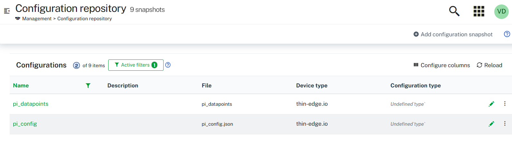

# PI Historian Service

A Python-based service for [thin-edge](https://thin-edge.io/) designed to read data from the AVEVA PI System using REST APIs and publish it to an MQTT broker via thin-edge. The application also supports live configuration updates, enabling runtime changes without the need for a restart.

## Architecture Diagram


## Features

- Periodic PI data collection via REST API (PI Web API)
- Structured MQTT message publishing
- Real-time monitoring of configuration file changes
- Dynamic reconfiguration without service restart

## Requirements

- Python 3.11+
- MQTT Broker (e.g., Mosquitto) version 2.1.0+
- Access to PI Web API

## Configuration

The following configuration files must be uploaded to the Cumulocity tenant for controlling the config changes remotely.

### Required Files

- `pi_config.json`: This contains PI server configuraton details that will be used to fetch the actual details and used for connecting the PI system.
    ```json
    {
        "RECORDING_AT_TIME": "?time=",
        "POLL_INTERVAL": 90,
        "PI_USER": "default_user",
        "PI_PASSWORD": "default_password-base64-encoded",
        "PI_URL": "https://default-url.com"
    }
- `datapoints.json`: This contains the list of tags that must be read by the script and integrated to the Cumulocity tenant along with any user friendly name (optional).
    ```json
    [
        "78FIQ301.A",
        "78FIC102.A"
    ]
Upload the above configuration files into Cumulocity-> Configuration Management tab, like below.


### Configuration via thin-edge

Update your `tedge-configuration-plugin` to include the configuration files uploaded to Cumulocity Configuration Management.

In the plugin configuration, the `type` values (for example, `pi_datapoints`) are the Cumulocity configuration type identifiers mapped to the local file paths; they are not the filenames themselves.

```toml
[[files]]
path = "/etc/tedge/tedge.toml"
type = "tedge.toml"

[[files]]
group = "tedge"
mode = 444
path = "/etc/tedge/plugins/tedge-log-plugin.toml"
type = "tedge-log-plugin"
user = "tedge"

[[files]]
path = "/etc/tedge/c8y/datapoints.json"
type = "pi_datapoints"
user = "tedge"
group = "tedge"
mode = 0o644

[[files]]
path = "/etc/tedge/c8y/pi_config.json"
type = "pi_config"
user = "tedge"
group = "tedge"
mode = 0o644
```
1. Push `tedge-configuration-plugin` configuration file first.
2. Then push:
   - `pi_config`
   - `pi_datapoints`

⚠️ The configuration plugin must be applied before deploying dependent configuration files.


## Prerequisites

Make sure the following are in place before proceeding:

- thin-edge installed and connected to the Cumulocity tenant — see [scripts/README.md](scripts/README.md) for the automated setup script
- Device registered as a thin-edge device
- Docker installed on the target VM
- Container group feature installed on the device
- Mosquitto broker exposed for external communication
- `unzip` package installed on the device

> **Automated setup:** `scripts/tedge_setup.sh` handles thin-edge installation, device registration, certificate download, MQTT configuration, and PI connector prerequisites in a single command. See [scripts/README.md](scripts/README.md) for full instructions.

### thin-edge MQTT configuration

The PI connector runs inside a Docker container and connects to the Mosquitto broker on the host via `host.containers.internal`. By default Mosquitto only listens on `localhost`, which blocks this connection. Run the following **once** after thin-edge is installed and before starting the PI connector:

```bash
# Allow Mosquitto to accept connections from Docker containers
sudo tedge config set mqtt.bind.address 0.0.0.0

# Apply the change by reconnecting thin-edge to Cumulocity
sudo tedge reconnect c8y
```

> These steps are automated by `scripts/tedge_setup.sh install` — see [scripts/README.md](scripts/README.md).

---

## Build Instructions

### Option 1: Download Prebuilt Release (Recommended)

Download the latest stable build directly from GitHub Releases:

**Latest Release:**  
[repo release](https://github.com/Cumulocity-IoT/thin-edge-aveva-pi-connector/releases)

Two release assets are published for each version:

| Asset | Description |
|---|---|
| `pi_historian_connector_<version>_online.zip` | Standard release — Docker image is pulled from Docker Hub on first run. Requires internet on the target device. |
| `pi_historian_connector_<version>_offline.zip` | Offline release — includes a pre-built Docker image tarball and pip wheels. No internet required on the target device. |

---

### Option 2: Build From Source

#### Build both ZIPs using the build script

Running `build_release.sh` produces **both** the online and offline ZIPs in a single pass:

```bash
git clone https://github.com/Cumulocity-IoT/thin-edge-aveva-pi-connector.git
cd thin-edge-aveva-pi-connector

chmod +x scripts/build_release.sh
scripts/build_release.sh 0.0.4
```

The script will:
1. Create `pi_historian_connector_v0.0.4_online.zip` — source files only
2. Download pip dependency wheels for Python 3.11 / Linux x86_64
3. Build the Docker image locally
4. Export the image as a `.tar.gz` tarball
5. Generate an offline `docker-compose.yaml` with the correct image reference
6. Bundle everything into `pi_historian_connector_v0.0.4_offline.zip`
7. Clean up all temporary files and staging directories

The release CI (`release.yml`) runs the same script automatically on every tag push (`v*`) and can also be triggered manually via **Actions → Build and Upload ZIP Release → Run workflow**.

---
## Deploy Using Prebuilt Release (Standard / Online)

1. Download the `*_online.zip` from [releases](https://github.com/Cumulocity-IoT/thin-edge-aveva-pi-connector/releases)

2. Unzip the package:
   ```bash
   unzip pi_historian_connector_v<version>_online.zip -d pi_historian_connector_v<version>
   cd pi_historian_connector_v<version>
   ```

3. Start the service (Docker will pull the image on first run):
   ```bash
   docker compose up -d
   ```

---

## Offline Installation

Use this procedure when the target device has **no internet access**. Download the `*_offline.zip` from [releases](https://github.com/Cumulocity-IoT/thin-edge-aveva-pi-connector/releases) or build it using `scripts/build_release.sh`.

### Prerequisites on the target device

- Docker installed and running
- `unzip` installed
- `docker compose` (v2) or `docker-compose` (v1) available

### Step 1 — Transfer the release bundle

Copy the `*_offline.zip` to the target device via USB, SCP, or any other transfer method:

```bash
scp pi_historian_connector_v0.0.4_offline.zip user@<device-ip>:/home/user/
```

### Step 2 — Unzip the bundle

```bash
unzip pi_historian_connector_v0.0.4_offline.zip -d pi_historian_connector_v0.0.4
cd pi_historian_connector_v0.0.4
```

The zip extracts files directly at the top level:

```
docker-compose.yaml                            # airgap service definition (pre-configured)
logging.conf                                   # logging configuration
requirements.txt                               # Python dependencies (reference only)
pi_historian_connector_0.0.4.tar.gz            # pre-built Docker image tarball
packages/                                      # pip wheels for offline pip install
  ├── requests-*.whl
  ├── urllib3-*.whl
  ├── paho_mqtt-*.whl
  ├── watchdog-*.whl
  └── ...
```

### Step 3 — Load the Docker image

```bash
docker load < pi_historian_connector_0.0.4.tar.gz
```

Verify the image was loaded:

```bash
docker images | grep pi_historian_connector
```

Expected output:
```
pi_historian_connector   0.0.4   <id>   ...
```

### Step 4 — Ensure config files are in place

The service mounts `/etc/tedge/c8y` — make sure the following files exist on the device before starting:

```
/etc/tedge/c8y/pi_config.json
/etc/tedge/c8y/datapoints.json
```

See the [Configuration](#configuration) section for the expected file formats.

### Step 5 — Start the service

```bash
docker compose up -d
```

### Step 6 — Verify it is running

```bash
docker compose ps
docker compose logs -f
```

### Stopping the service

```bash
docker compose down
```

## Production Deployment via Cumulocity

### 1. Upload the Zipped Archive

- Go to the **Cumulocity Software Management UI**
- Upload the `.zip` file
- Set the **Software Type** to `container-group`

### 2. Deploy to thin-edge Device

- Navigate to the target **thin-edge device** in Cumulocity Device Management
- Go to **Software > Install**
- Select the uploaded software package and version

The container will be deployed and started automatically on the thin-edge VM.


## MIT License

This project is licensed under the MIT License. See the [LICENSE](LICENSE) file for full details.

## Disclaimer
AVEVA, PI System, and PI Server are trademarks or registered trademarks of AVEVA Group plc or its subsidiaries in the U.S. and other countries. This project is an independent open-source initiative and is not affiliated with, sponsored by, or endorsed by AVEVA.

-------------------------------------------
These tools are provided as-is and without warranty or support. They do not constitute part of the Cumulocity product suite. Users are free to use, fork and modify them, subject to the license agreement. While Cumulocity GmbH welcomes contributions, we cannot guarantee to include every contribution in the master project.

----------------------------------
You can find additional information in the [Cumulocity Community](https://community.cumulocity.com/).

