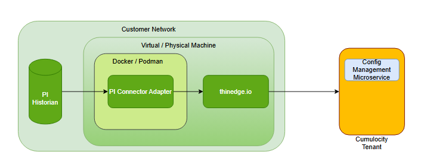

# PI Historian Service

A Python-based service for [Thin Edge](https://thin-edge.io/) designed to read data from the AVEVA PI System and publish it to an MQTT broker. The application also supports live configuration updates, enabling runtime changes without the need for a restart.

## Architecture Diagram


## Features

- Periodic PI data collection via REST API (PI Web API)
- Structured MQTT message publishing
- Real-time monitoring of configuration file changes
- Dynamic reconfiguration without service restart

## Requirements

- Python 3.9+
- MQTT Broker (e.g., Mosquitto) version 2.1.0+
- Access to PI Web API

## Configuration

The following configuration files must be uploaded to the Cumulocity tenant for controlling the config changes remotely.

### Required Files

- `pi_config.json`: This contains PI server configuraton details that will be used to fetch the actual details and used for connecting the PI system.
    ```json
    {
        "RECORDING_AT_TIME": "?time=",
        "POLL_INTERVAL": 90
    }
- `datapoints.json`: This contains the list of tags that must be read by the script and integrated to the Cumulocity tenant along with any user friendly name (optional).
    ```json
    [
        "78FIQ301.A",
        "78FIC102.A"
    ]
### Configuration via Thin Edge

Update your `tedge-configuration-plugin` to include the configuration files:

```toml
[[files]]
path = "/etc/tedge/tedge.toml"
type = "tedge.toml"

[[files]]
group = "tedge"
mode = 444
path = "/etc/tedge/plugins/tedge-log-plugin.toml"
type = "tedge-log-plugin"
user = "tedge"

[[files]]
path = "/etc/tedge/c8y/datapoints.json"
type = "pi_datapoints"
user = "tedge"
group = "tedge"
mode = 0o644

[[files]]
path = "/etc/tedge/c8y/pi_config.json"
type = "pi_config"
user = "tedge"
group = "tedge"
mode = 0o644
```
Push these configurations from Cumulocity Device Management under the Configuration tab of the Thin Edge device.

Sample pi_config.json
```
{
    "RECORDING_AT_TIME": "?time=",
    "POLL_INTERVAL": 90
}

```
## Prerequisites

Make sure the following are in place before proceeding:

- Thin Edge installed and connected to the Cumulocity tenant
- Device registered as a Thin Edge device
- Docker installed on the target VM
- Container group feature installed on the device
- Mosquitto broker exposed for external communication
- `unzip` package installed on the device

---

## Build Steps

1. **Clone the repository**

```bash
git clone https://your-repo-url.git
```
2. **Create deployable file**

```bash
zip -r package_name.zip . -x "config/*" "config-management/*" "scripts/*"
```
## Deployment Instructions

### 1. Upload the Zipped Archive

- Go to the **Cumulocity Software Management UI**
- Upload the `.zip` file
- Set the **Software Type** to `container-group`

### 2. Deploy to Thin Edge Device

- Navigate to the target **Thin Edge device** in Cumulocity Device Management
- Go to **Software > Install**
- Select the uploaded software package and version

The container will be deployed and started automatically on the Thin Edge VM.
