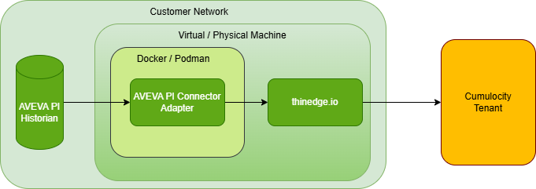

# PI Historian Service

A Python-based service for [thin-edge](https://thin-edge.io/) designed to read data from the AVEVA PI System using REST APIs and publish it to an MQTT broker via thine-edge. The application also supports live configuration updates, enabling runtime changes without the need for a restart.

## Architecture Diagram


## Features

- Periodic PI data collection via REST API (PI Web API)
- Structured MQTT message publishing
- Real-time monitoring of configuration file changes
- Dynamic reconfiguration without service restart

## Requirements

- Python 3.9+
- MQTT Broker (e.g., Mosquitto) version 2.1.0+
- Access to PI Web API

## Configuration

The following configuration files must be uploaded to the Cumulocity tenant for controlling the config changes remotely.

### Required Files

- `pi_config.json`: This contains PI server configuraton details that will be used to fetch the actual details and used for connecting the PI system.
    ```json
    {
        "RECORDING_AT_TIME": "?time=",
        "POLL_INTERVAL": 90,
        "PI_USER": "default_user",
        "PI_PASSWORD": "default_password-base64-encoded",
        "PI_URL": "https://default-url.com"
    }
- `datapoints.json`: This contains the list of tags that must be read by the script and integrated to the Cumulocity tenant along with any user friendly name (optional).
    ```json
    [
        "78FIQ301.A",
        "78FIC102.A"
    ]
    ```
Upload the above configuration files into Cumulocity-> Configuration Management tab, like below.


### Configuration via Thin Edge

Update your `tedge-configuration-plugin` to include the configuration files upload into c8y configuration management:

```toml
[[files]]
path = "/etc/tedge/tedge.toml"
type = "tedge.toml"

[[files]]
group = "tedge"
mode = 444
path = "/etc/tedge/plugins/tedge-log-plugin.toml"
type = "tedge-log-plugin"
user = "tedge"

[[files]]
path = "/etc/tedge/c8y/datapoints.json"
type = "pi_datapoints"
user = "tedge"
group = "tedge"
mode = 0o644

[[files]]
path = "/etc/tedge/c8y/pi_config.json"
type = "pi_config"
user = "tedge"
group = "tedge"
mode = 0o644
```
First, push the `tedge-configuration-plugin` configuration file from Cumulocity Device Management under the Configuration tab of the Thin Edge device.
After that, push the remaining configuration files such as `pi_config` and `pi_datapoints`.


## Prerequisites

Make sure the following are in place before proceeding:

- Thin Edge installed and connected to the Cumulocity tenant
- Device registered as a Thin Edge device
- Docker installed on the target VM
- Container group feature installed on the device
- Mosquitto broker exposed for external communication
- `unzip` package installed on the device

---

## Build Instructions

### Option 1: Download Prebuilt Release (Recommended)

Download the latest stable build directly from GitHub Releases:

**Latest Release:**  
[repo release](https://github.com/Cumulocity-IoT/thin-edge-aveva-pi-connector/releases)

Download the latest `.zip` package and deploy it to your target environment.

---

### Option 2: Build From Source

If you prefer to build the package manually, follow the steps below.

1. **Clone the repository**

```bash
git clone https://github.com/Cumulocity-IoT/thin-edge-aveva-pi-connector.git
```
2. **Create deployable file**

```bash
    zip "$ZIP_NAME" \
            app.py \
            docker-compose.yaml \
            Dockerfile \
            requirements.txt
```
## Deployment Instructions

### 1. Upload the Zipped Archive

- Go to the **Cumulocity Software Management UI**
- Upload the `.zip` file
- Set the **Software Type** to `container-group`

### 2. Deploy to Thin Edge Device

- Navigate to the target **Thin Edge device** in Cumulocity Device Management
- Go to **Software > Install**
- Select the uploaded software package and version

The container will be deployed and started automatically on the Thin Edge VM.

## MIT License

Copyright (c) 2026 Cumulocity-IoT

Permission is hereby granted, free of charge, to any person obtaining a copy
of this software and associated documentation files (the "Software"), to deal
in the Software without restriction, including without limitation the rights
to use, copy, modify, merge, publish, distribute, sublicense, and/or sell
copies of the Software, and to permit persons to whom the Software is
furnished to do so, subject to the following conditions:

The above copyright notice and this permission notice shall be included in all
copies or substantial portions of the Software.

THE SOFTWARE IS PROVIDED "AS IS", WITHOUT WARRANTY OF ANY KIND, EXPRESS OR
IMPLIED, INCLUDING BUT NOT LIMITED TO THE WARRANTIES OF MERCHANTABILITY,
FITNESS FOR A PARTICULAR PURPOSE AND NONINFRINGEMENT. IN NO EVENT SHALL THE
AUTHORS OR COPYRIGHT HOLDERS BE LIABLE FOR ANY CLAIM, DAMAGES OR OTHER
LIABILITY, WHETHER IN AN ACTION OF CONTRACT, TORT OR OTHERWISE, ARISING FROM,
OUT OF OR IN CONNECTION WITH THE SOFTWARE OR THE USE OR OTHER DEALINGS IN THE
SOFTWARE.

## Disclaimer
AVEVA, PI System, and PI Server are trademarks or registered trademarks of AVEVA Group plc or its subsidiaries in the U.S. and other countries. This project is an independent open-source initiative and is not affiliated with, sponsored by, or endorsed by AVEVA.

