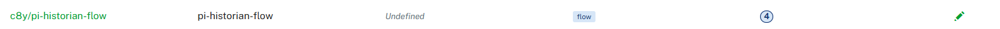

# pi-historian-flow

A [thin-edge.io](https://thin-edge.io) flow that polls an **AVEVA PI Web API** server on a configurable interval and publishes measurements and metadata to **Cumulocity IoT** via MQTT.

## Architecture

```
 ┌─────────────────────────────────────────────────────────────────┐
 │  scripts/poll-pi.sh  (long-running loop)                        │
 │                                                                  │
 │   every POLL_INTERVAL seconds (from pi_config.json, default 60) │
 │        │                                                         │
 │        ├── curl ──► PI Web API  /dataservers                     │
 │        ├── curl ──► PI Web API  /points?namefilter=<tag>         │
 │        └── curl ──► PI Web API  /recordeddata/attime?time=<ts>  │
 │                                                                  │
 │   outputs to stdout:  TOPIC <TAB> JSON_PAYLOAD                   │
 │   (one line per message; multiple lines when 16 KB chunking)     │
 └───────────────────────┬─────────────────────────────────────────┘
                         │ stdout stream
                         ▼
 ┌─────────────────────────────────────────────────────────────────┐
 │  tedge-flows  [input.process]                                    │
 │  continuous subprocess — no fixed interval in flows.toml         │
 │                                                                  │
 │  wraps each line as:  Message { topic, payload }                 │
 └───────────────────────┬─────────────────────────────────────────┘
                         │ Message
                         ▼
 ┌─────────────────────────────────────────────────────────────────┐
 │  dist/main.js  onMessage()                                       │
 │  splits payload on TAB → topic | json                            │
 │  re-emits on the embedded topic                                  │
 └───────────┬───────────────────────────────┬─────────────────────┘
             │                               │
             ▼                               ▼
 c8y/measurement/               te/device/main///twin/
 measurements/create            pi_historianMetadata
 { measurement chunk }  ×N      { tag metadata chunk }  ×N
```

- **`poll-pi.sh`** — shell script that owns all HTTP traffic; runs as a long-lived subprocess so the poll interval can be adjusted at runtime from Cumulocity without restarting the mapper.
- **`tedge-flows input.process`** — streams each stdout line of the script into the JS step as an MQTT message.
- **`dist/main.js`** — pure message router compiled from `src/main.ts`; no networking, no state — just a tab-split and re-emit.

## Prerequisites

| Requirement | Notes |
|---|---|
| thin-edge.io ≥ 2.0 | With `tedge-mapper-c8y` running |
| `curl` | Standard on most Linux distros |
| `jq` | `apt install jq` |
| Node.js + npm | Build-time only — not needed at runtime |

## Configuration

The script resolves configuration from two sources in priority order:

| Source | Fields | Updated via |
|---|---|---|
| `/etc/tedge/c8y/pi_config.json` | `PI_URL`, `PI_USER`, `PI_PASSWORD`, `POLL_INTERVAL` | Cumulocity config management |
| `/etc/tedge/c8y/datapoints.json` | tag list | Cumulocity config management |
| `params.toml` | all fields (fallback) | manual edit on device |

When a JSON file is present it takes precedence over `params.toml` for its fields. This means credentials and the tag list can be updated remotely from Cumulocity without touching the device directly.

### `/etc/tedge/c8y/pi_config.json`

Created by `tedge_setup.sh` during installation. Can be pushed again at any time from Cumulocity → Device Management → Configurations.

```json
{
    "PI_URL":             "https://your-pi-server/piwebapi",
    "PI_USER":            "piuser",
    "PI_PASSWORD":        "base64encodedpassword",
    "POLL_INTERVAL":      60,
    "RECORDING_AT_TIME":  "?time="
}
```

### `/etc/tedge/c8y/datapoints.json`

Plain JSON array of PI tag names. Created by `tedge_setup.sh` and updatable remotely.

```json
[
    "REACTOR01.TEMP",
    "PUMP02.FLOW",
    "COMPRESSOR.PRESSURE"
]
```

### `params.toml` (fallback)

Used for any field not supplied by the JSON files above, and for fields that have no JSON equivalent (`query_filter`, `measurement_type`, `output_topic`, `metadata_topic`, `debug`).

Copy the template and fill in your values:

```bash
cp params.toml.template params.toml
```

```toml
# Fallback — used when /etc/tedge/c8y/pi_config.json is absent
pi_url      = "https://your-pi-server/piwebapi"
pi_user     = "piuser"
pi_password = "base64encodedpassword"

# Fallback — used when /etc/tedge/c8y/datapoints.json is absent
datapoints = ["REACTOR01.TEMP", "PUMP02.FLOW", "COMPRESSOR.PRESSURE"]

# Always read from params.toml (no JSON equivalent)
measurement_type = "pi_historianMeasurement"
output_topic     = "c8y/measurement/measurements/create"
metadata_topic   = "te/device/main///twin"
query_filter     = "?query=PointType:Float32&namefilter="
debug            = false
```

### PI Web API query filter

`query_filter` is appended directly to the dataserver's Points link URL. The default restricts results to `Float32` points. Adjust if your tags use a different type (e.g. remove the `PointType:Float32` clause to match all types).

### SSL / self-signed certificates

If your PI Web API uses a self-signed certificate, add `-k` to the `curl` call in `scripts/poll-pi.sh`:

```bash
pi_get() {
    curl -skf \
        -H "Authorization: $AUTH" \
        ...
```

## Build

```bash
npm install
npm run build        # outputs dist/main.js
```

## Deploy

```bash
# Copy everything to the tedge flows directory
npm run deploy:local

# Reload the mapper to pick up the new flow
systemctl restart tedge-mapper-c8y
```

The deploy copies the full project (including `scripts/`, `dist/`, `flows.toml`, and `params.toml`) into `/etc/tedge/mappers/c8y/flows/pi-historian-flow/`.

## Remote deployment via Cumulocity Software Management

1. Build the tarball: `npm run package` — produces `pi-historian-flow.tar.gz` one level up.
2. In Cumulocity → Software Repository, upload the tarball with:
   - **Name**: `c8y/pi-historian-flow` *(the `flow` sm-plugin requires `<mapper>/<flow-name>` format)*
   - **Version**: `1.0.0` (or the current version)
   - **Software type**: `flow`
3. Install the software on the target device from Device Management → Software.

The plugin unpacks the tarball into `/etc/tedge/mappers/c8y/flows/pi-historian-flow/` and reloads the mapper automatically.



## Undeploy

```bash
npm run undeploy:local
```

## Verify

Check the flow is running and the script is firing:

```bash
# Watch the mapper logs
journalctl -fu tedge-mapper-c8y | grep pi-historian

# Manually run the script (from the flow directory)
cd /etc/tedge/mappers/c8y/flows/pi-historian-flow
bash ./scripts/poll-pi.sh
```

The script runs as a long-lived process and loops indefinitely. Each poll cycle prints at least two lines to stdout (more when chunking splits a large payload), then sleeps for `POLL_INTERVAL` seconds before the next cycle:

```
c8y/measurement/measurements/create	{"type":"pi_historianMeasurement","time":"...","pi_historianMeasurement":{...}}
te/device/main///twin/pi_historianMetadata	{"tags":{...},"lastUpdated":"..."}
```

Press `Ctrl+C` to stop the manual run. Additional lines per cycle appear only when the tag count is large enough to exceed the 16 KB chunk limit.

Enable `debug = true` in `params.toml` to log each tag's fetched value to stderr (visible in the mapper journal).

## Output format

### Measurements

Published to `c8y/measurement/measurements/create` on every poll cycle (interval controlled by `POLL_INTERVAL` in `pi_config.json`, default 60 s). When the full set of tags would produce a payload larger than 16 KB, the script emits multiple messages — each a self-contained measurement fragment sharing the same timestamp:

```json
{
  "type": "pi_historianMeasurement",
  "time": "2026-06-22T07:28:47Z",
  "pi_historianMeasurement": {
    "REACTOR01_TEMP":      { "value": 125.5, "unit": "degC" },
    "PUMP02_FLOW":         { "value": 42.1,  "unit": "m3/h" },
    "COMPRESSOR_PRESSURE": { "value": 8.3,   "unit": "bar"  }
  }
}
```

Tag names have dots replaced with underscores (PI convention → valid JSON key).

Tags returning a `SystemStateCode` object (e.g. motor state enumerations) include a `stringValue` field alongside the numeric `value`.

Tags that return non-numeric or unsupported values are silently skipped.

### Metadata

Published to `te/device/main///twin/pi_historianMetadata` on every poll cycle (idempotent). Large tag sets are split into multiple twin-update messages, each under 16 KB. Cumulocity thin-edge merges each partial update into the device managed object:

```json
{
  "tags": {
    "REACTOR01_TEMP": { "description": "Reactor 1 Inlet Temperature" },
    "PUMP02_FLOW":    { "description": "Feed Pump 2 Flow Rate" }
  },
  "lastUpdated": "2026-06-22T07:28:47Z"
}
```

## Project structure

```
pi-historian-flow/
├── flows.toml              # tedge-flows definition (input.process + JS step)
├── params.toml             # runtime config (gitignored — contains credentials)
├── params.toml.template    # checked-in defaults, safe to commit
├── scripts/
│   └── poll-pi.sh          # curl-based PI Web API poller
├── src/
│   └── main.ts             # JS message router (tab-split → MQTT topic)
├── dist/
│   └── main.js             # esbuild output — deployed to device
└── package.json
```

## Development notes

**Why a shell script instead of JS?**
The tedge-flows JavaScript runtime (QuickJS via rquickjs) intentionally exposes no networking APIs — only `console`, `crypto`, `TextEncoder`/`TextDecoder`, and a KV store. All HTTP calls must happen outside the JS sandbox. The `[input.process]` mechanism in `flows.toml` runs the shell script as a long-lived subprocess; its stdout lines are streamed into the JS step as MQTT messages.

**Why compact JSON (`jq -c`)?**
`input.process` delivers each stdout line as a separate message. `jq` defaults to pretty-printed (multi-line) JSON, which would split a single payload across many messages. The `-c` flag forces single-line output, keeping each `TOPIC\tPAYLOAD` pair on one line.

**Why a self-managed loop instead of `interval` in `flows.toml`?**
The `interval` field in `flows.toml` is static — it cannot be changed at runtime. Moving the sleep into the script itself means `POLL_INTERVAL` is re-read from `pi_config.json` on every cycle, so a new value pushed from Cumulocity takes effect on the next tick without restarting the mapper.

**Config resolution order**
On each poll cycle the script re-reads `/etc/tedge/c8y/pi_config.json` (`PI_URL`, `PI_USER`, `PI_PASSWORD`, `POLL_INTERVAL`) and `/etc/tedge/c8y/datapoints.json` (tag list). If a file is present it takes precedence over the equivalent `params.toml` fields. Changes pushed from Cumulocity are therefore picked up automatically on the next cycle — no restart required.

**Why 16 KB chunks?**
The Cumulocity MQTT broker enforces a 16 KB maximum message size. When a polling cycle covers many PI tags, the combined measurement or twin-update JSON can exceed this limit. The script accumulates tags into a running chunk and flushes it as a separate MQTT message whenever the next tag would push the payload past 16 384 bytes. Measurement chunks and twin chunks are tracked independently, since the two payload structures have different per-entry overhead.
